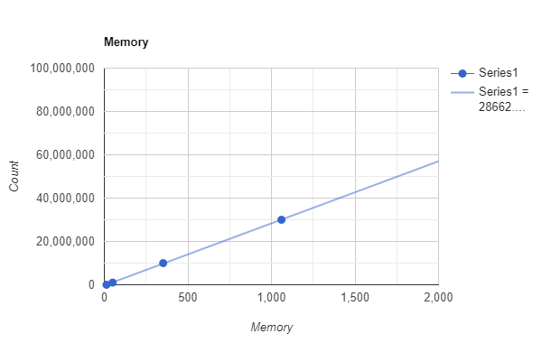
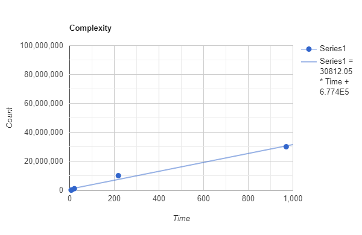

# HLC21
Highload Course. Ex 21

1. Для замірів використав рішення з вправи 17
2. Заміряв через dotMemory i dotTrace - профайлери для .net від JetBrains
3. Результат для заміру пам'яті

10000 елементів - 12.9 mb
1000000 елементів - 49.64 mb
10000000 елементів - 352 mb
30000000 елементів - 1060 mb

4. Результат для заміру витрат часу

10000 елементів - 6.4mc
100000 елементів - 8.9mc
1000000 елементів - 21mc
10000000 елементів - 218mc
30000000 елементів - 970mc

